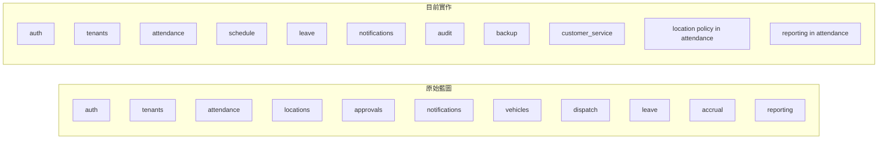

# 原始藍圖 vs 目前實作 對照矩陣

> 目的：把你當初偏 `vibe coding` 階段形成的原始藍圖，與目前實際系統落地結果拆開來看，避免後續修正方向被既有實作綁死。  
> 使用方式：當你要決定「我要往哪邊修」時，先看這份判斷是要回歸藍圖、承認現況、還是重切模組。

---

## 1. 為什麼需要這份文件

原始藍圖與現況實作不同，不代表哪個一定錯。

但如果沒有對照表，你會很難分辨：

- 這是有意識的設計演進
- 還是實作過程被帶偏
- 哪些差異值得保留
- 哪些差異應該回頭修正

所以這份文件不是要否定現況，而是幫你建立：

> 「我原本想做什麼」 vs 「我現在真的做成什麼」 vs 「接下來我應該往哪裡收斂」

---

## 2. 對照來源

### 原始藍圖來源（歷史追溯）
- `SA/legacy-import/docs/01_ARCHITECTURE/SA_MODULE_SPEC_v2.1.md`
- `SA/legacy-import/docs/01_ARCHITECTURE/SYSTEM_BLUEPRINT_SAAS_MULTI_TENANT_v1.md`

> 以上僅保留為歷史藍圖來源與追溯材料，不作為現況正式判準。

### 現況正式來源
- `SA/architecture/SYSTEM_SDD.md`
- `SA/architecture/MODULE_BOUNDARY_MATRIX.md`
- `backend/app/modules/*`
- `frontend/src/*`

---

## 3. 總體結論

### 3.1 原始藍圖偏向的方向
- 平台優先（platform-first）
- 模組化清楚切分
- 多租戶與 company_id 強約束
- 希望把 reporting / locations / approvals 等能力獨立化

### 3.2 現況實作偏向的方向
- 先把核心營運需求做出來
- 優先完成 attendance 主流程
- 一些原本想獨立的能力，先收在現有模組內
- `attendance` 成為最大聚合模組

### 3.3 你的後續修正核心
你現在真正要做的不是「盲目回歸原始藍圖」，而是判斷：

1. 哪些藍圖是對的，值得拉回來
2. 哪些現況已證明比較適合目前系統
3. 哪些能力應維持子域，不必急著獨立模組
4. 哪些能力已經肥到應該從 `attendance` 拆出去

---

## 4. 規劃模組總表

| 模組 | 原始藍圖是否規劃 | 目前是否存在實作 | 現況狀態 | 修正判斷 |
|---|---|---|---|---|
| `auth` | 是 | 是 | 已落地 | 維持 |
| `tenants` | 是 | 是 | 已落地 | 維持 |
| `attendance` | 是 | 是 | 已落地且過胖 | 持續收斂子域 |
| `schedule` | 早期藍圖未明確突出，現況已形成正式模組 | 是 | 已落地 | 視為現況正式設計 |
| `leave` | 是 | 是 | 已落地 | 維持 |
| `notifications` | 是 | 是 | 已落地 | 維持 |
| `audit` | 是 | 是 | 已落地 | 維持 |
| `backup` | 是 | 是 | 已落地 | 維持 |
| `customer_service` | 原始藍圖已有客服跨公司 scope 規劃 | 是 | 已落地 | 維持 |
| `locations` | 是 | 否（獨立模組不存在） | 功能內嵌於 `attendance` | 後續判斷是否拆模組 |
| `approvals` | 是 | 否（獨立模組不存在） | 語意分散 | 先補責任邊界再決定 |
| `reporting` | 是 | 否（獨立模組不存在） | 目前屬 `attendance` 子域 | 暫不急拆，但需持續觀察 |
| `accrual` | 是 | 否 | 尚未落地 | 保留規劃 |
| `vehicles` | 是 | 否 | 尚未落地 | 保留規劃 |
| `dispatch` | 是 | 否 | 尚未落地 | 保留規劃 |

---

## 5. 原始藍圖 vs 現況詳細對照

### 5.1 auth

| 面向 | 原始藍圖 | 現況 | 判斷 |
|---|---|---|---|
| 核心定位 | 平台身份入口、JWT、scope 基礎 | 已符合 | 一致 |
| 與 tenant 關係 | 驗證 membership / assignment | 已符合 | 一致 |
| 後續方向 | 穩定作為平台 identity source | 不需大改 | 維持 |

### 5.2 tenants

| 面向 | 原始藍圖 | 現況 | 判斷 |
|---|---|---|---|
| 核心定位 | 公司、會員、entitlements、onboarding | 已符合 | 一致 |
| 與其他模組關係 | 提供 company 治理基線 | 已符合 | 一致 |
| 後續方向 | 持續維持為 company source of truth | 不應被 attendance 吞掉 | 維持 |

### 5.3 attendance

| 面向 | 原始藍圖 | 現況 | 判斷 |
|---|---|---|---|
| 核心定位 | 出勤核心 | 已符合 | 一致 |
| 模組體積 | 原始藍圖希望模組化 | 現況過胖 | 最大修正點 |
| 目前內容 | 打卡、break、session、policy、reporting、location、legacy | 全部集中 | 應持續切子域 |
| 後續方向 | 不一定立刻拆模組，但一定要控制邊界 | 先穩子域，再決定是否外拆 | 重點治理 |

### 5.4 schedule

| 面向 | 原始藍圖 | 現況 | 判斷 |
|---|---|---|---|
| 核心定位 | 原始文件未像現在這樣成熟定義 | 現況已明確成為排班模組 | 屬於設計演進 |
| 與 attendance 關係 | 原始上偏向 attendance policy 依賴排班概念 | 現況明確化 baseline source | 是好演進 |
| 後續方向 | 保持 schedule 為預期工時來源 | 不應再被打回 attendance 附屬功能 | 正式保留 |

### 5.5 leave

| 面向 | 原始藍圖 | 現況 | 判斷 |
|---|---|---|---|
| 核心定位 | 請假模組 | 已符合 | 一致 |
| 後續方向 | 維持獨立 | 不應與 attendance 工時計算混寫 | 維持 |

### 5.6 notifications

| 面向 | 原始藍圖 | 現況 | 判斷 |
|---|---|---|---|
| 核心定位 | 事件轉通知 | 已符合 | 一致 |
| 互動方式 | EventBus 為優先 | 已符合 | 一致 |
| 後續方向 | 保持 consumer，不做主業務決策 | 維持 |

### 5.7 audit

| 面向 | 原始藍圖 | 現況 | 判斷 |
|---|---|---|---|
| 核心定位 | 稽核查詢 / 匯出 / retention | 已符合 | 一致 |
| 後續方向 | 保持治理模組 | 不要混入一般業務計算 | 維持 |

### 5.8 backup

| 面向 | 原始藍圖 | 現況 | 判斷 |
|---|---|---|---|
| 核心定位 | 單一公司備份還原 | 已符合 | 一致 |
| 與多租戶關係 | 必須受 company scope 控制 | 已符合 | 一致 |
| 後續方向 | 維持治理模組 | 維持 |

### 5.9 customer_service

| 面向 | 原始藍圖 | 現況 | 判斷 |
|---|---|---|---|
| 核心定位 | 客服跨公司操作 scope | 已落地 | 一致 |
| 後續方向 | 持續作為 support assignment 邊界 | 維持 |

### 5.10 locations

| 面向 | 原始藍圖 | 現況 | 判斷 |
|---|---|---|---|
| 核心定位 | 可獨立成 locations 模組 | 目前不存在獨立模組 | 有落差 |
| 現況落地方式 | location policy 內嵌在 `attendance` | 屬過渡方案可能性高 | 待決策 |
| 修正建議 | 若 location 之後會有 CRUD / policy / geofence / reuse 成長，再考慮獨立 | 現階段可先維持 attendance 子域 | 觀察 |

### 5.11 approvals

| 面向 | 原始藍圖 | 現況 | 判斷 |
|---|---|---|---|
| 核心定位 | 原本規劃成可獨立流程模組 | 目前沒有獨立模組 | 有落差 |
| 可能現況 | 分散在 leave / attendance 的具體流程內 | 尚未清晰 | 待整理 |
| 修正建議 | 先明確「approval 是共用引擎，還是 leave 專屬流程」 | 不宜直接硬拆 | 待補設計 |

### 5.12 reporting

| 面向 | 原始藍圖 | 現況 | 判斷 |
|---|---|---|---|
| 核心定位 | 原本偏向獨立 reporting 模組 | 現況為 attendance 子域 | 有落差 |
| 現況合理性 | 若報表主要仍服務 attendance，留在子域合理 | 短期可接受 | 可暫維持 |
| 修正建議 | 若未來跨多模組報表成長，再考慮獨立 reporting module | 目前先守住 read-only 子域原則 | 持續觀察 |

### 5.13 accrual / vehicles / dispatch

| 面向 | 原始藍圖 | 現況 | 判斷 |
|---|---|---|---|
| 核心定位 | 原始藍圖預留未來模組 | 尚未落地 | 正常 |
| 修正建議 | 不要為了對齊藍圖而先建空模組 | 等實際需求成熟再設計 | 保留規劃 |

---

## 6. Mermaid 對照圖

---

## 7. 修正決策規則

當藍圖與現況不同時，請用這個規則判斷：

### 7.1 回歸原始藍圖
適用於：
- 現況只是臨時塞進去
- 已造成模組過胖
- 已造成邊界混亂
- 原始藍圖的分工其實更合理

### 7.2 承認現況並升格為正式設計
適用於：
- 現況已經穩定
- 原始藍圖當時其實還不成熟
- 現況模組切法更符合實際開發需求
- 已有正式文件與穩定 consumer contract

### 7.3 保持子域，不急著拆模組
適用於：
- 功能雖然可獨立，但目前規模還不夠大
- 抽模組成本大於收益
- 現在更需要先穩 semantic / API / boundary

### 7.4 未來再拆模組
適用於：
- 子域已經長大到難以維護
- 查詢與寫入路徑已經明顯分化
- 有多模組共用需求
- 已形成獨立團隊 / 獨立 lifecycle / 獨立 API 邊界

---

## 8. 目前建議的收斂方向

### 優先級 P0
- 穩住 `attendance` 的子域邊界：capture / reporting / policy / location / legacy
- 把 `schedule -> attendance` 的 baseline contract 繼續文件化
- 把原始藍圖與現況差異明文化，不再靠記憶判斷

### 優先級 P1
- 判斷 `reporting` 是否仍適合留在 `attendance` 子域
- 判斷 `locations` 是否會成長成獨立模組
- 釐清 `approvals` 是共用引擎還是流程語意

### 優先級 P2
- 對 `accrual` / `vehicles` / `dispatch` 保留規劃，但不要過早落地

---

## 9. 你之後怎麼用這份文件

如果你未來要驗證某功能，例如：
- 地點打卡到底應該在 `attendance` 還是 `locations`
- 報表到底要不要獨立成 `reporting`
- 請假審批是否要抽 `approvals`

你就可以依這三步做：

1. 先看原始藍圖是不是曾打算獨立
2. 再看現況是否已穩定形成子域
3. 最後決定要回歸藍圖、維持子域、還是承認現況

---

## 10. 關聯文件

- `SA/architecture/SYSTEM_ARCHITECTURE_DIAGRAM.md`
- `SA/architecture/SYSTEM_SDD.md`
- `SA/architecture/MODULE_BOUNDARY_MATRIX.md`
- `SA/modules/attendance.md`
- `SA/modules/schedule.md`

---

## 11. 已依目前 baseline 補充的產品判斷（2026-04-08）

- `reporting`（報表）目前先維持為 `attendance`（出勤）子域，不急著獨立模組
- 原因是目前 P0 報表重點仍是出勤查閱，不是跨多模組 BI
- 員工端重點是手機查看自己當月紀錄
- `HR / 管理端` 負責正式列印、勞檢備查、異常排查
- `locations`（地點）目前可先維持在 attendance 子域；若未來成長出獨立 CRUD / geofence / reuse，再考慮拆模組
- `approvals`（審批）仍需先釐清是共用引擎還是業務流程內嵌能力，現階段不急著硬拆
