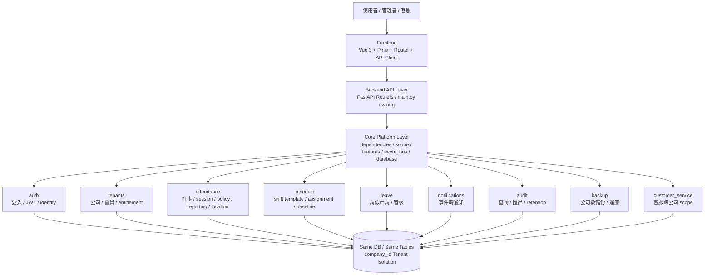
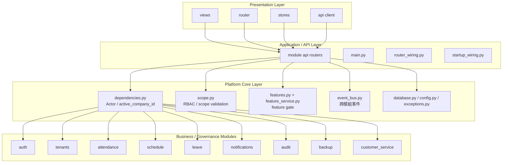
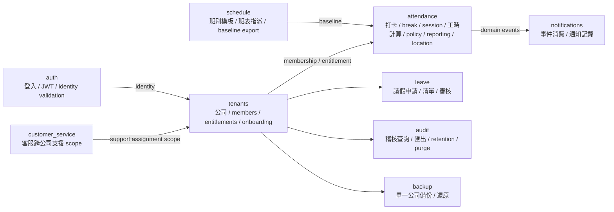
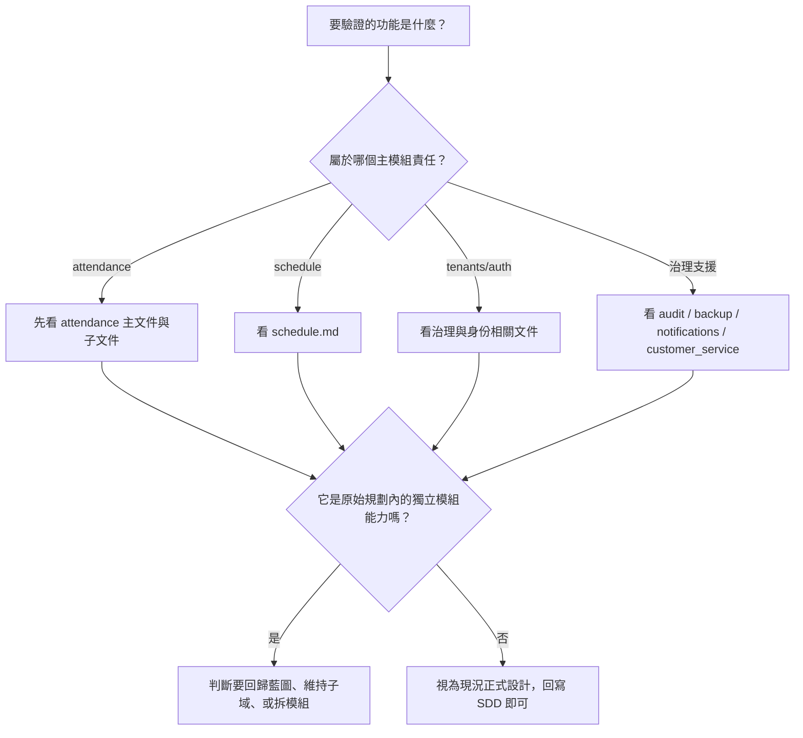

# 系統架構圖與功能驗證基線

> 目的：把目前系統的正式架構，以**可直接拿來驗證功能歸屬**的圖像化方式整理出來。  
> 使用方式：當你要判斷某功能應該保留、修正、搬移、獨立成模組，先看這份，再對照 `SA/architecture/PLANNED_VS_IMPLEMENTED_MATRIX.md`。

---

## 1. 這份文件要解決什麼問題

你先前的原始藍圖是在偏 `vibe coding` 的情境下逐步形成，過程中很容易被實作或 AI 的臨時建議牽著走，因此會出現：

- 原始規劃與現況實作不完全一致
- 功能先做了，但模組歸屬不夠穩定
- 某些能力原本想做獨立模組，後來先塞進既有模組
- 回頭看時，難以判斷「這是設計選擇」還是「臨時妥協」

這份文件的用途就是提供一個**現況可驗證的系統架構圖基線**，讓你之後補完整 SDD 時，有一張可以反覆對照的圖。

---

## 2. 使用規則

當你在判斷某功能該往哪邊修正時，請依序問：

1. 這個功能屬於哪個模組的主責任？
2. 這個功能是業務寫入、查詢、治理能力，還是平台能力？
3. 它現在放的位置，是正式設計，還是過渡期實作？
4. 如果它跟原始藍圖不同，是要：
   - 回歸原始藍圖
   - 承認現況並回寫 SDD
   - 拆成新模組
   - 保持子域內部整併

---

## 3. 系統總體架構圖

---

## 4. 分層架構圖

---

## 5. 模組責任圖

---

## 6. 現況主責任邊界

| 模組 | 主責任 | 不應主導的內容 | 判斷說明 |
|---|---|---|---|
| `auth` | 登入、JWT、身份入口 | 出勤、請假、排班業務 | 所有業務模組只應消費其身份結果 |
| `tenants` | 公司、會員、entitlement、onboarding | 打卡規則、請假判定 | 它是租戶治理與 company source of truth |
| `attendance` | 打卡、session、break、工時、policy、reporting、location | 公司治理、JWT、本體排班 CRUD | 目前最肥大，也是最需要持續切清子域的模組 |
| `schedule` | 班表模板、assignment、baseline | 最終遲到早退判定、實際打卡寫入 | 它定義應該怎麼上班，不定義實際怎麼打卡 |
| `leave` | 請假申請與審核流程 | 出勤工時計算 | 可引用 scope，但不應吸收 attendance 主責任 |
| `notifications` | 事件落地通知 | 主業務決策 | 只消費事件，不反向主導業務語意 |
| `audit` | 稽核查詢、匯出、保留、清除 | 一般業務計算 | 治理模組 |
| `backup` | 公司級資料備份還原 | 一般業務規則判定 | 治理模組 |
| `customer_service` | 客服支援 company scope | 公司內部一般業務流程 | 平台角色治理模組 |

---

## 7. 關鍵互動關係

### 7.1 attendance 與 schedule
- `schedule` 是預期工時與班表來源
- `attendance` 只消費排班 baseline 做政策判定
- 若 `attendance` 開始自己定義第二套班表 normalization，代表邊界失守

### 7.2 attendance 與 notifications
- `attendance` 產生 domain event
- `notifications` 消費事件並落地成可查詢通知
- `notifications` 不應反向決定 `attendance` semantic

### 7.3 auth / tenants / core 與所有模組
- `auth` 提供登入與 token
- `core.dependencies` 建立 actor 與 active company
- `tenants` 提供 company / membership / entitlement 的治理基線
- 其他模組不應自行發明 company scope 規則

---

## 8. 最需要驗證的高風險區

### 8.1 attendance 過胖
目前 `attendance` 同時承擔：
- capture
- reporting
- policy
- location
- 部分 legacy compatibility

這代表它是目前最容易偏離原始藍圖的地方。

### 8.2 reporting 尚未獨立
原始藍圖曾規劃 `reporting` 獨立，但現況仍在 `attendance` 內。

這不是錯，但你之後要判斷：
- 是保留為 attendance 子域
- 還是等規模成熟後再抽成獨立模組

### 8.3 locations 尚未獨立
原始藍圖有 `locations` 想法，但現況 location policy 在 `attendance` 內。

這表示目前 location 比較像出勤的支援子域，而不是獨立業務模組。

---

## 9. 功能驗證時的判斷流程

---

## 10. 與其他文件的關係

這份文件搭配以下文件一起使用：

- `SA/architecture/SYSTEM_SDD.md`
- `SA/architecture/MODULE_BOUNDARY_MATRIX.md`
- `SA/architecture/PLANNED_VS_IMPLEMENTED_MATRIX.md`
- `SA/modules/*.md`

其中：
- 這份文件負責「圖像化理解」
- `PLANNED_VS_IMPLEMENTED_MATRIX.md` 負責「原始藍圖 vs 現況落地對照」
- `SYSTEM_SDD.md` 負責「正式敘述版設計說明」
- `modules/*.md` 負責「模組級實作與開發判斷」
